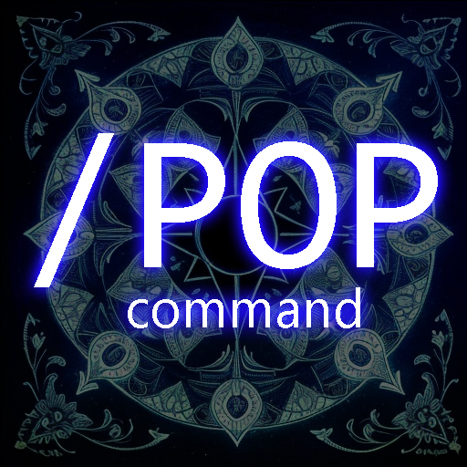
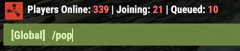

/pop command for oxide rust server, it shows how many players are online, connecting and queued to enter the server.

The Pop plugin displays the number of connected, connecting, and queued players in a Rust server. It provides commands for individual players to check the server population and for broadcasting the server population to all players.

Features
- Displays the number of online, joining, and queued players.
- Provides a personal command for individual players to check the server population.
- Provides a global command for broadcasting the server population to all players.
- Configurable command names, broadcast delay, and color codes for different player statuses.
- Supports permissions to control who can use the commands.

Commands
- /pop: Displays the number of online, joining, and queued players to the player who issued the command.
- !pop: Broadcasts the number of online, joining, and queued players to all players in the server (default 10 min delay).
Configuration

The configuration options for the plugin are as follows:
- Command: The name of the personal command. Default is "pop".
- BroadcastCommand: The name of the global command. Default is "!pop".
- OnlineColor: The color code for online players. Default is "#ff686b".
- JoiningColor: The color code for joining players. Default is "#ff686b".
- QueuedColor: The color code for queued players. Default is "#ff686b".
- BroadcastDelay: The delay in minutes between broadcasts. Default is 10.
- EnablePersonalCommand: Whether to enable the personal command. Default is true.
- EnableGlobalCommand: Whether to enable the global command. Default is true.

Permissions
- pop.use: Allows a player to use the /pop and !pop commands.

